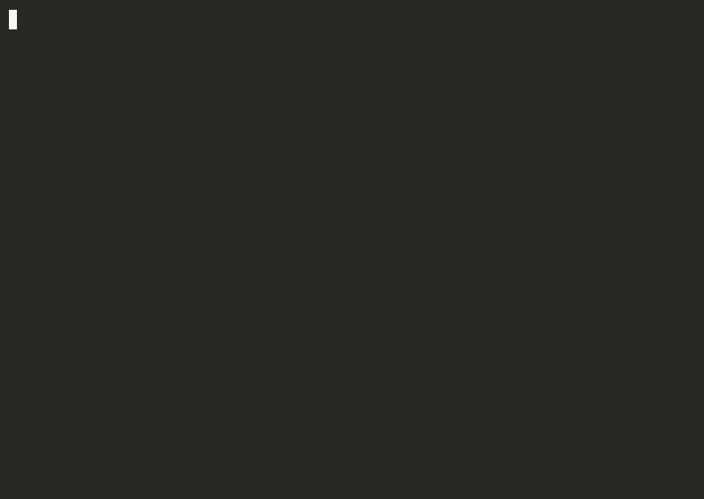
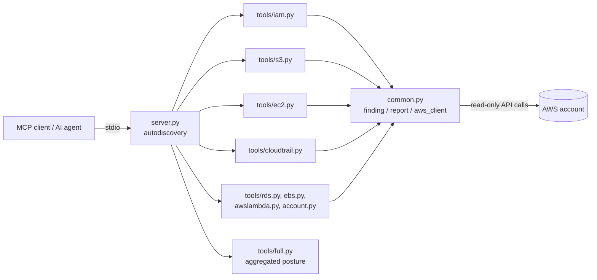

# aws-audit-mcp

[](https://github.com/OmniNomadLLC/aws-audit-mcp/actions/workflows/ci.yml) [](https://pypi.org/project/aws-audit-mcp/) <!-- PyPI badge activates after the first release -->


Read-only AWS security audits, exposed as MCP tools. Point an AI agent at this server and it can answer "is this account in good shape?" with evidence instead of vibes: stale access keys, users without MFA, root account posture, public S3 buckets, world-open security groups, and CloudTrail coverage, each returned as normalized findings with severities an agent can reason about.



## Try it in 60 seconds, no AWS account needed

```bash
pip install "aws-audit-mcp[demo]"
curl -sO https://raw.githubusercontent.com/OmniNomadLLC/aws-audit-mcp/main/examples/demo.py
python demo.py
```

The demo builds a deliberately misconfigured account in [moto](https://github.com/getmoto/moto)
(an in-memory AWS emulator, nothing leaves your machine) and runs the aggregated audit against
it: seven findings, a posture score, and a letter grade, exactly what an agent gets back.

## Read-only, and provably so

This server never mutates anything. That claim is enforced in three layers, not asserted once in a docstring:

1. **A single client factory.** Every boto3 client in the codebase is created through `aws_client()` in `common.py`. Grep for `aws_client(` and you have every AWS touchpoint; there is nowhere else for a write call to hide.
2. **MCP tool annotations.** Every tool is registered with `ToolAnnotations(read_only_hint=True, destructive_hint=False)`, so MCP clients see the read-only contract at the protocol level.
3. **A CI eval.** The test suite greps every tool module for mutating boto3 verbs (create, put, delete, update, attach, and friends) and fails the build if one appears.

Honesty requires one more sentence: the real security boundary is IAM, not this code. Run the server with the least-privilege policy in [examples/iam-policy.json](examples/iam-policy.json), which grants exactly the read actions the tools call and nothing else. The policy uses `Resource: "*"` because these are account-wide list and describe actions: auditing "all IAM users" or "all buckets" is inherently account-scoped, and constraining resources would silently blind the audit.

## Quickstart

Install from PyPI (available after the first release):

```bash
pip install aws-audit-mcp
```

Or install from git (or a local clone):

```bash
pip install git+https://github.com/OmniNomadLLC/aws-audit-mcp.git
```

Add it to Claude Code:

```bash
claude mcp add aws-audit-mcp --env AWS_PROFILE=audit --env AWS_REGION=eu-west-1 -- aws-audit-mcp
```

Or for any MCP client, the generic config:

```json
{
  "mcpServers": {
    "aws-audit-mcp": {
      "command": "aws-audit-mcp",
      "env": {
        "AWS_PROFILE": "audit",
        "AWS_REGION": "eu-west-1"
      }
    }
  }
}
```

Credentials resolve through the standard boto3 chain (`AWS_PROFILE`, environment variables, instance roles), the same way every AWS tool works.

## Tools

| Tool | Audits | Key severities |
| --- | --- | --- |
| `audit_stale_access_keys(max_age_days=90)` | active IAM keys older than the threshold | HIGH if the user has no MFA, else MEDIUM |
| `audit_users_without_mfa()` | console users without MFA | HIGH |
| `audit_root_account_posture()` | root MFA and root access keys | CRITICAL for root keys, HIGH for missing MFA |
| `audit_public_buckets()` | bucket ACLs, wildcard-principal policies, missing or weakened public access block | HIGH / MEDIUM |
| `audit_world_open_security_groups(region=None)` | ingress from 0.0.0.0/0 or ::/0 | HIGH on admin/db ports or all traffic, MEDIUM otherwise |
| `audit_trail_posture(region=None)` | trail exists, logging, multi-region, log validation, CMK | CRITICAL / MEDIUM / LOW |
| `account_security_summary()` | account id, IAM summary, account-level S3 public access block | HIGH / MEDIUM |
| `audit_rds_posture(region=None)` | publicly accessible, unencrypted, unprotected RDS instances | HIGH / MEDIUM / LOW |
| `audit_ebs_exposure(region=None)` | unencrypted EBS volumes and publicly shared snapshots | CRITICAL / MEDIUM |
| `audit_lambda_resource_policies(region=None)` | Lambda functions invocable by anyone or by unconditioned service principals | HIGH / MEDIUM |
| `audit_full_posture()` | runs every audit above and returns severity counts, a weighted posture score and a letter grade | aggregate |

Every tool returns the same envelope: `{check, ok, findings[], scanned}`. Every finding has `{check, severity, title, resource, detail}` with severity one of LOW, MEDIUM, HIGH, CRITICAL. The `scanned` count exists so a clean result is trustworthy: `scanned: 0, findings: []` and `scanned: 200, findings: []` are very different answers.

## Example output

```json
{
  "check": "iam.stale_access_keys",
  "ok": false,
  "findings": [
    {
      "check": "iam.stale_access_keys",
      "severity": "HIGH",
      "title": "Active access key is 412 days old and the user has no MFA",
      "resource": "arn:aws:iam::111111111111:user/ci-deploy",
      "detail": {
        "access_key_id": "AKIAEXAMPLEEXAMPLE",
        "age_days": 412,
        "max_age_days": 90,
        "user_has_mfa": false
      }
    }
  ],
  "scanned": 14
}
```

## Architecture



Six lines, because that is all there is:

- `server.py` autodiscovers tool modules: anything in `tools/` exposing `register(mcp)` is loaded.
- One module per AWS surface: `iam.py`, `s3.py`, `ec2.py`, `cloudtrail.py`, `account.py`.
- The shared contract lives in `common.py`: `finding()`, `report()`, and the `aws_client()` factory.
- Adding a check means adding one module plus its tests; the server does not change.

## Testing and evals

- **Unit tests** run against [moto](https://github.com/getmoto/moto), so every check is exercised against simulated AWS accounts with no credentials required.
- **Contract evals** assert that every tool is documented, typed, annotated read-only, and returns the standard envelope.
- **A bad-account scenario eval** builds a deliberately misconfigured moto account and asserts the tools catch every planted issue.
- CI runs all of it on every push.

This project is built AI-assisted, with the discipline that makes that safe: every change
passes the unit tests, the contract evals, and the machine-checked read-only gate before it
lands on main. Every claim in this README is verified by CI, not by the author's memory.

## Related

The event-driven sibling of this project is [aws-secops-lab](https://github.com/OmniNomadLLC/aws-secops-lab): that one detects changes in seconds, this one audits state on demand.

## License

MIT, see [LICENSE](LICENSE).
